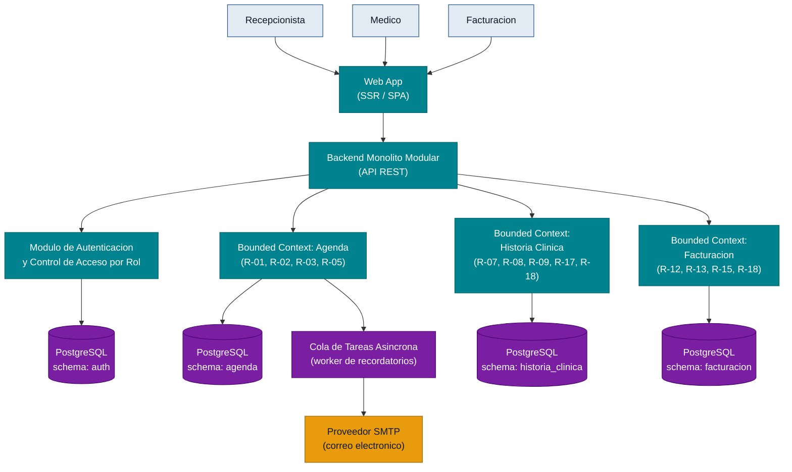

# Arquitectura — citamedicos MVP
> Fecha: 2026-06-20 | Fuente: epics.md, backlog.json, inbox/mvp-canvas.md, inbox/requisitos.md

## Visión general

El MVP de citamedicos es un sistema web de gestión clínica compuesto por tres bounded contexts (Agenda, Historia Clínica, Facturación) que comparten una base de datos relacional con schemas separados. La arquitectura adopta el patrón de **monolito modular**: un único proceso de backend con separación interna clara de responsabilidades, una aplicación web como front-end y un worker asíncrono dedicado exclusivamente al envío de recordatorios por correo electrónico. El principio rector es la máxima simplicidad que cumpla las métricas del Discovery: 0 conflictos de agenda, carga de HC en menos de 3 segundos y traspaso automático al módulo de facturación mayor o igual al 95 %.

## Diagrama de componentes

> Nota: los cuatro schemas de PostgreSQL residen en la misma instancia de base de datos en el MVP. El diagrama los representa separados para reflejar el aislamiento lógico y la posibilidad de separación futura.

## Componentes

### Web App (SSR / SPA)

**Responsabilidad:** Interfaz de usuario accesible desde navegador. Presenta el calendario unificado, el formulario de historia clínica y el módulo de facturación según el rol autenticado. Consume la API REST del backend.

**Justificación:** Los tres roles de usuario (recepcionista, médico, responsable de facturación) requieren acceso desde múltiples sedes (mvp-canvas.md — Resultado esperado; R-07: accesible desde cualquier sede). Una aplicación web no requiere instalación y es independiente del sistema operativo del cliente, lo que reduce el costo de despliegue en una clínica pequeña.

### Backend Monolito Modular (API REST)

**Responsabilidad:** Punto de entrada único para todas las operaciones de negocio. Orquesta los tres bounded contexts; aplica las reglas de autorización antes de delegar a cada módulo interno.

**Justificación:** Los módulos comparten entidades (paciente, visita) y requieren consistencia transaccional para evitar citas dobles (US-02) y garantizar el traspaso automático (US-06). Un monolito modular es suficiente para el volumen de una clínica pequeña y elimina la complejidad operativa de los microservicios. Decisión registrada en ADR-0001.

### Modulo de Autenticacion y Control de Acceso por Rol

**Responsabilidad:** Gestión de sesiones y autorización. Emite tokens (JWT) y verifica permisos antes de acceder a HC y facturación. Define tres roles: `recepcionista`, `medico`, `facturacion`.

**Justificación:** R-18 exige confidencialidad de HC y datos de facturación con control de acceso por rol. Decisión registrada en ADR-0004.

### Bounded Context: Agenda

**Responsabilidad:** Calendario unificado en tiempo real (R-01, R-03), bloqueo automático de conflictos con control de concurrencia (R-02), y encolado de recordatorios para su despacho asíncrono 24 horas antes de cada cita (R-05).

**Justificación:** El dolor principal de la recepcionista es la fragmentación de agendas y los conflictos de horario (personas.md — dolores `conflictos-horario`, `sistemas-fragmentados`). El bloqueo de conflictos requiere transacciones con bloqueo pesimista o mecanismo equivalente a nivel de base de datos. El encolado de recordatorios desacopla el envío de correo del flujo de confirmación de cita (ADR-0003).

### Bounded Context: Historia Clinica

**Responsabilidad:** Ficha clínica por paciente (antecedentes, alergias, medicamentos) y registro cronológico de evolución de consulta. Garantiza carga en menos de 3 segundos mediante índices apropiados en PostgreSQL.

**Justificación:** R-17 establece el SLA de 3 segundos; R-18 restringe el acceso al rol `medico`. La consistencia y las relaciones fuertes entre paciente, cita y nota clínica hacen del modelo relacional la opción más directa (ADR-0002).

### Bounded Context: Facturacion

**Responsabilidad:** Recepción automática de servicios/procedimientos desde la Historia Clínica al cierre de consulta, consolidación de servicios por visita y generación de factura (R-12, R-13, R-15). Muestra el estado de pago pendiente.

**Justificación:** El dolor del responsable de facturación es la transcripción manual y la pérdida de servicios (personas.md — dolores `procedimientos-mal-registrados`, `consolidacion-manual-servicios`). El traspaso automático es un evento interno del monolito: cuando el médico cierra la consulta en HC, el bounded context de Facturación recibe la señal sin intervención manual.

### Cola de Tareas Asincrona (worker de recordatorios)

**Responsabilidad:** Procesa tareas programadas de envío de correo. Recibe la tarea cuando se confirma la cita y la ejecuta en el instante T-24 h. Gestiona reintentos ante fallos del proveedor SMTP.

**Justificación:** R-05 (recordatorio automático) y R-19 (disponibilidad sin interrupciones): el envío de correo no debe bloquear la operación de agenda ni afectar la disponibilidad del sistema si el proveedor SMTP falla. Decisión registrada en ADR-0003.

### PostgreSQL (instancia unica, schemas separados)

**Responsabilidad:** Persistencia de todos los bounded contexts con aislamiento lógico por schema (`agenda`, `historia_clinica`, `facturacion`, `auth`).

**Justificación:** R-17 (rendimiento), R-18 (confidencialidad), US-02 (consistencia transaccional para bloqueo de citas). Decisión registrada en ADR-0002.

## Decisiones registradas en ADRs

| ADR | Decisión |
|-----|---------|
| ADR-0001 | Adoptar monolito modular con bounded contexts en lugar de microservicios |
| ADR-0002 | Usar PostgreSQL relacional con schemas separados por bounded context |
| ADR-0003 | Procesar recordatorios por correo mediante cola de tareas asincrona |
| ADR-0004 | Autenticacion propia con JWT y tres roles fijos para el MVP |
| ADR-0005 | Aplazar la migracion de datos historicos al MVP |

## Supuestos abiertos

Los siguientes puntos surgen del Discovery pero no tienen evidencia suficiente para convertirse en decisiones de arquitectura en este momento. Se registran como preguntas abiertas para resolver antes o durante el sprint:

- **OQ-04 — Migracion de datos historicos:** mvp-canvas.md lo identifica como riesgo alto. No existe historia tecnica que lo cubra. La arquitectura no contempla ninguna canalización de migracion en el MVP (ver ADR-0005).
- **SLA de carga del calendario:** R-17 define el SLA de 3 s unicamente para HC. No hay evidencia en el inbox de un SLA equivalente para la vista de agenda. No se decide ningun mecanismo de cache o pre-calculo para la agenda hasta que este SLA se defina.
- **Permisos granulares por subtipo de medico:** R-18 menciona control de acceso por rol pero el inbox no diferencia entre medico tratante, medico de guardia y medico de otra especialidad. El MVP define un unico rol `medico`; los permisos granulares se difieren a la iteracion 2.
- **Canal de recordatorios:** El inbox no confirma si el recordatorio se envia por correo electronico, SMS o WhatsApp. La arquitectura prepara el worker asíncrono con SMTP como unico canal; se podra extender si se confirma otro canal antes del sprint.
- **Infraestructura de despliegue:** El inbox no especifica si la clínica tiene servidor propio, hosting gestionado o nube publica. Esta decision afecta la configuracion del worker y la instancia de PostgreSQL, pero no la estructura de componentes del MVP.
