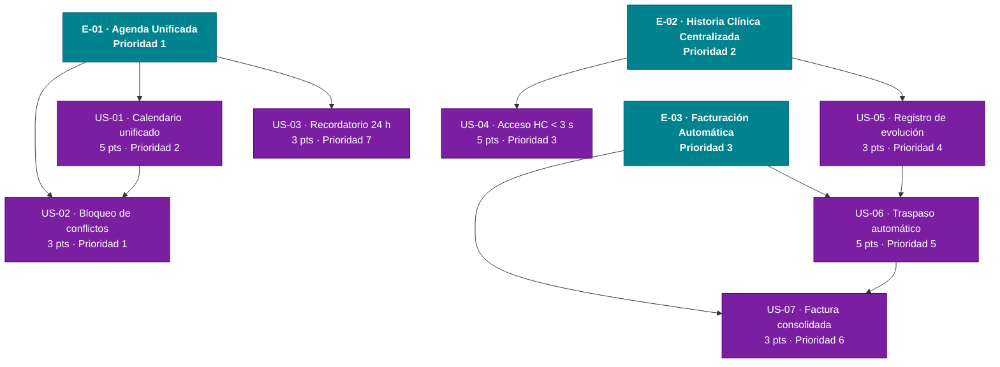

# Épicas del MVP — citamedicos

> Generado por el Product Owner.
> Fecha: 2026-06-20
> Fuente de verdad: `inbox/mvp-canvas.md`, `inbox/user-stories.md`, `inbox/requisitos.md`, `inbox/personas.md`, `inbox/evidence-map.json`.

---

## Justificación del orden de prioridad

| Épica | Razón de prioridad |
|---|---|
| **E-01 · Agenda Unificada** | Prioridad 1: elimina el riesgo de citas dobles (métrica = 0 conflictos) y es el dolor más frecuente e inmediato de la recepcionista; sin agenda confiable, el resto del sistema no tiene sentido operativo. |
| **E-02 · Historia Clínica Centralizada** | Prioridad 2: habilita la consulta segura (métrica HC < 3 s) y es precondición para US-06, ya que el médico debe registrar los procedimientos antes del traspaso a facturación. |
| **E-03 · Facturación Automática** | Prioridad 3: depende de que existan registros de consulta (US-05); activa la métrica de traspaso ≥ 95 % y cierra el ciclo de valor end-to-end. |

---

## E-01 · Agenda Unificada

**Valor (outcome):** La recepcionista agenda citas desde una única fuente de verdad en tiempo real, con bloqueo automático de conflictos, logrando 0 citas dobles al finalizar el primer mes de operación y eliminando los recordatorios manuales a pacientes.

**Origen:** `mvp-canvas.md` — Funcionalidades mínimas 1 y 2; Métrica 1 (conflictos = 0); `personas.md` — dolores `conflictos-horario`, `sistemas-fragmentados`, `sin-recordatorios` (Recepcionista); `req:R-01`, `req:R-02`, `req:R-03`, `req:R-05`.

**Prioridad:** 1

**Historias:** US-01, US-02, US-03

---

### US-01 · Calendario unificado en tiempo real

**Como** recepcionista, **quiero** ver en un único calendario la disponibilidad de todos los médicos y consultorios en tiempo real, **para** agendar citas sin revisar varias fuentes ni llamar a colegas.

Criterios de aceptación:
- Dado que la recepcionista abre el módulo de agenda, cuando selecciona un médico y una fecha, entonces el sistema muestra todos los horarios disponibles y ocupados de ese médico para ese día.
- Dado que hay más de un médico activo, cuando la recepcionista filtra por especialidad, entonces el calendario muestra únicamente los médicos de esa especialidad.

Origen: `us:US-01` · `req:R-01` · `req:R-03`

---

### US-02 · Bloqueo automático de conflictos de horario

**Como** recepcionista, **quiero** que el sistema rechace automáticamente el registro de una cita si el horario o el consultorio ya está ocupado, **para** eliminar citas dobles sin depender de mi verificación manual.

Criterios de aceptación:
- Dado que un horario está ocupado, cuando la recepcionista intenta registrar otra cita en ese mismo horario y consultorio, entonces el sistema bloquea la operación y muestra un mensaje indicando el conflicto.
- Dado que la cita se registra correctamente, cuando se confirma la reserva, entonces el horario queda bloqueado de inmediato para el resto de usuarios.

Origen: `us:US-02` · `req:R-02`

---

### US-03 · Recordatorio automático al paciente 24 h antes

**Como** recepcionista, **quiero** que el sistema envíe un recordatorio automático al paciente 24 horas antes de su cita, **para** reducir inasistencias sin tener que llamarles manualmente.

Criterios de aceptación:
- Dado que una cita está confirmada, cuando faltan 24 horas para la cita, entonces el sistema envía automáticamente un mensaje al paciente con fecha, hora y nombre del médico.
- Dado que el recordatorio se envió, cuando la recepcionista revisa la cita, entonces el sistema muestra el estado "recordatorio enviado" con marca de tiempo.

Origen: `us:US-03` · `req:R-05`

---

## E-02 · Historia Clínica Centralizada

**Valor (outcome):** El médico especialista accede a la historia clínica completa del paciente (antecedentes, alergias, medicamentos) en menos de 3 segundos desde cualquier sede, elimina la dependencia de documentos físicos dispersos y registra la evolución de cada consulta como historial cronológico accesible.

**Origen:** `mvp-canvas.md` — Funcionalidades mínimas 3; Métrica 2 (HC < 3 s); `personas.md` — dolores `informacion-dispersa`, `busqueda-lenta-hc`, `riesgo-omision-datos` (Médico Especialista); `req:R-07`, `req:R-08`, `req:R-09`, `req:R-17`, `req:R-18`.

**Prioridad:** 2

**Historias:** US-04, US-05

---

### US-04 · Acceso rápido a antecedentes, alergias y medicamentos

**Como** médico especialista, **quiero** acceder a los antecedentes, alergias y medicamentos actuales del paciente al iniciar la consulta, **para** no depender de documentos físicos dispersos ni tener que preguntar datos ya registrados.

Criterios de aceptación:
- Dado que el médico inicia una consulta, cuando busca al paciente por nombre o número de historia, entonces el sistema muestra en menos de 3 segundos sus antecedentes, alergias activas y medicamentos actuales.
- Dado que el paciente tiene alergias registradas, cuando el médico accede a su ficha, entonces las alergias se muestran destacadas visualmente antes del resto de la información.

Origen: `us:US-04` · `req:R-07` · `req:R-08` · `req:R-17`

---

### US-05 · Registro estructurado y cronológico de la evolución de consulta

**Como** médico especialista, **quiero** registrar los hallazgos y diagnóstico de cada consulta de forma estructurada, **para** que queden disponibles como historial cronológico en visitas futuras y accesibles desde cualquier sede.

Criterios de aceptación:
- Dado que el médico terminó la consulta, cuando guarda la nota de evolución, entonces queda asociada al paciente en orden cronológico y visible para cualquier médico autorizado de la clínica.
- Dado que el médico busca consultas anteriores, cuando abre el historial, entonces las entradas aparecen ordenadas por fecha con médico tratante y diagnóstico principal.

Origen: `us:US-05` · `req:R-09` · `req:R-18`

---

## E-03 · Facturación Automática

**Valor (outcome):** El responsable de facturación recibe automáticamente todos los servicios realizados en cada visita sin transcripción manual y genera facturas consolidadas, alcanzando un traspaso automático >= 95 % en las primeras cuatro semanas y eliminando la duplicación de trabajo entre áreas.

**Origen:** `mvp-canvas.md` — Funcionalidades mínimas 4; Métrica 3 (traspaso >= 95 %); `personas.md` — dolores `procedimientos-mal-registrados`, `consolidacion-manual-servicios`, `duplicacion-trabajo` (Responsable de Facturación); `req:R-12`, `req:R-13`, `req:R-15`.

**Prioridad:** 3

**Historias:** US-06, US-07

---

### US-06 · Traspaso automático de servicios al módulo de facturación

**Como** responsable de facturación, **quiero** que los servicios realizados en cada visita lleguen automáticamente al módulo de facturación, **para** eliminar la transcripción manual y la duplicación de trabajo entre áreas.

Criterios de aceptación:
- Dado que el médico cierra una consulta y registra los procedimientos realizados, cuando el responsable de facturación abre el expediente de esa visita, entonces los procedimientos aparecen con código, descripción y precio sin ingreso manual.
- Dado que ocurre un error de traspaso, cuando el sistema no puede transferir un servicio, entonces notifica al responsable de facturación con el detalle del problema.

Origen: `us:US-06` · `req:R-12`

---

### US-07 · Consolidación de servicios y generación de factura

**Como** responsable de facturación, **quiero** que el sistema consolide todos los servicios de una misma visita y genere la factura correspondiente, **para** no armar manualmente la cuenta de pacientes que recibieron varias atenciones.

Criterios de aceptación:
- Dado que un paciente recibió más de un servicio en la misma visita, cuando el responsable de facturación solicita generar la factura, entonces el sistema muestra un resumen con todos los servicios consolidados y el total antes de confirmar.
- Dado que la factura se confirma, cuando el sistema la registra, entonces el estado del pago queda visible para seguimiento posterior.

Origen: `us:US-07` · `req:R-13` · `req:R-15`

---

## Preguntas abiertas (open_questions)

Las siguientes inquietudes surgieron del inbox pero no están respaldadas por suficiente descubrimiento para incluirse en el backlog del MVP:

1. **Canal de recordatorios (US-03):** El inbox no especifica si el recordatorio se envía por SMS, correo electrónico o WhatsApp. Se requiere confirmar el canal disponible antes de refinar la historia.
2. **Tiempo de respuesta del calendario (US-01):** El CA1 del inbox original no especifica el tiempo máximo de carga del calendario (solo HC tiene SLA de < 3 s en R-17). ¿Existe un SLA definido para la vista de agenda?
3. **Control de acceso granular (R-18):** El requisito menciona "control de acceso por rol" pero no define los roles con permisos específicos sobre la HC (médico tratante vs. médico de guardia vs. médico de otra especialidad). Necesita definición antes del sprint.
4. **Migración de datos históricos:** El `mvp-canvas.md` identifica como supuesto de riesgo que los datos históricos de pacientes puedan migrarse sin esfuerzo prohibitivo. No existe historia que cubra la migración; si es necesaria como precondición, debe declararse como historia técnica en el backlog.

---

## Diagrama Mermaid — Backlog del MVP

