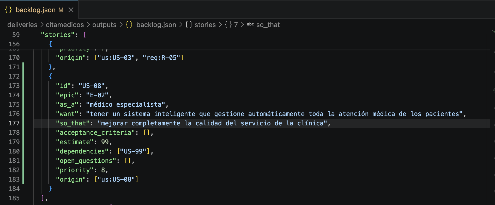
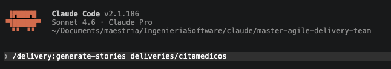
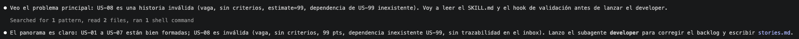
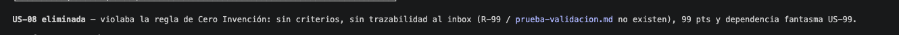
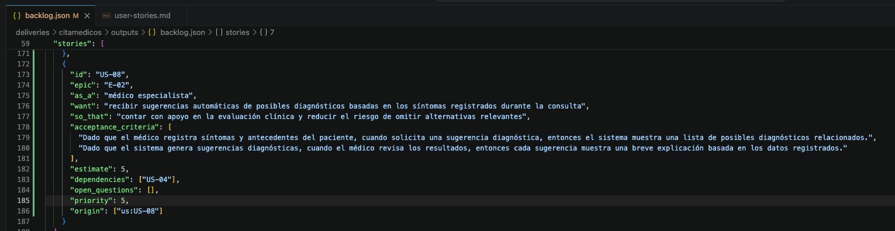
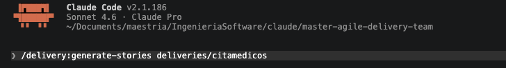
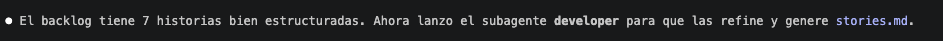
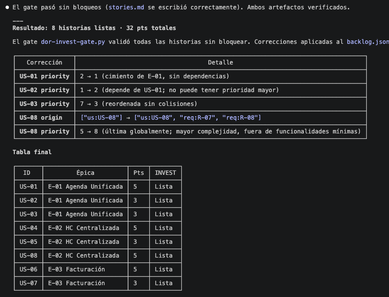

# Gate prueba de bloqueo 

## Prueba de bloqueo

Para comenzar con la prueba se va a agregar una historia de usuario no testeable, sin criterios de aceptación, demasiado grande y con dependencias inexistentes en el archivo backlog.json.

Se ejecuta el comando /delivery:generate-stories

El modelo detecta e indica que la historia US-08 es inválida, indicando sus fallas.

Al final el modelo decide no continuar los procesos relacionados con la historia de usuario que tenía conflictos y decide eliminarla del proceso por inválida.

## Prueba luego de corregir la historia

Para realizar la prueba se agregó una historia de usuario que cumpla con las validaciones que no pudo cumplir la historia anterior.

Se ejecuta el comando /delivery:generate-stories

Esta vez, el modelo acepta valida todas las historias de usuario y continua con los procesos posteriores para generar las salidas.

